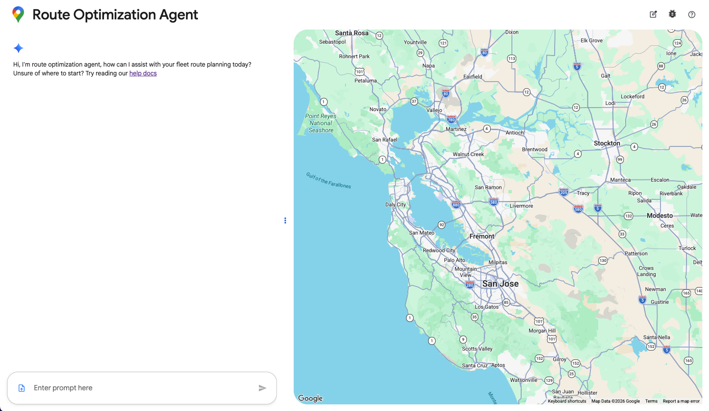

An Angular 20 single page application providing a chat interface for the agent.



## Local development
1. Create and setup `public/config.json` as defined below
1. Install dependencies with `npm install`
1. Start the API
1. Start the app with `npm start`

### Configuration
Below is an example structure for the application configuration:

```json
{
  "apiUrl": "http://localhost:8000", // This will be the same as the URL you have deployed the application under
  "mapsApiKey": "MAPS_KEY", // See the infrastructure README for more info
  "mapId": "MAP_ID"
}
```

## Other development helpers
- Run tests with `npm run test`
- Run the linter with `npm run lint`
- Automatically fix style issues with `npm run style-fix`